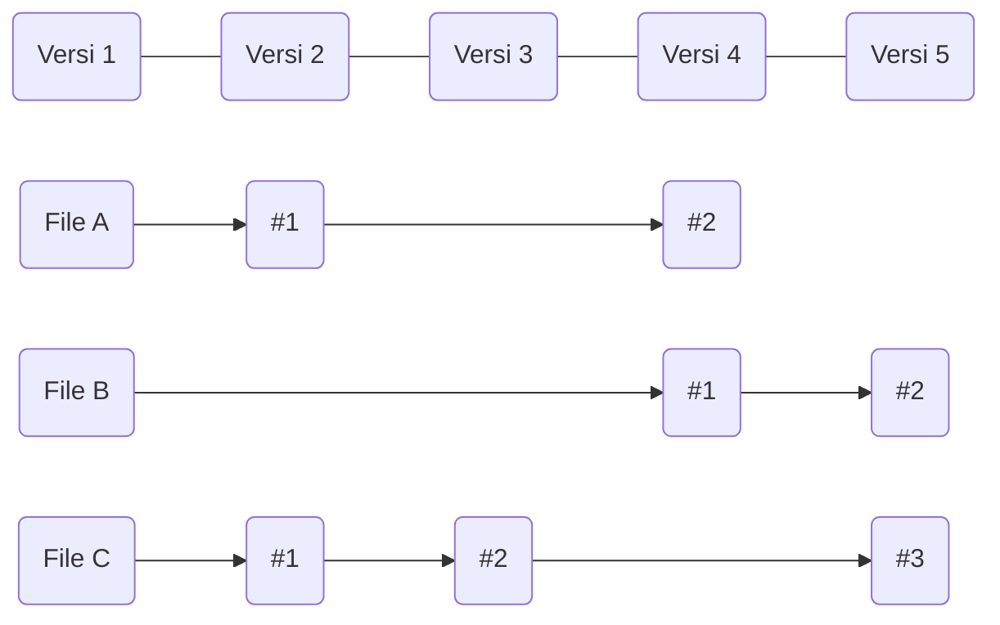
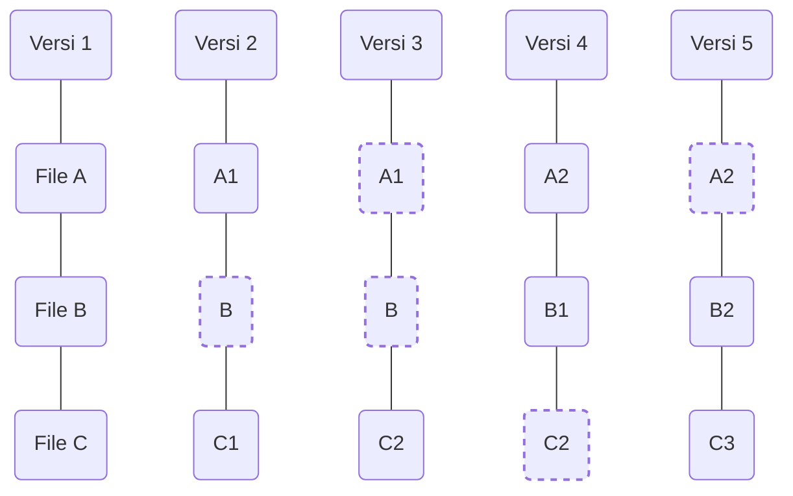
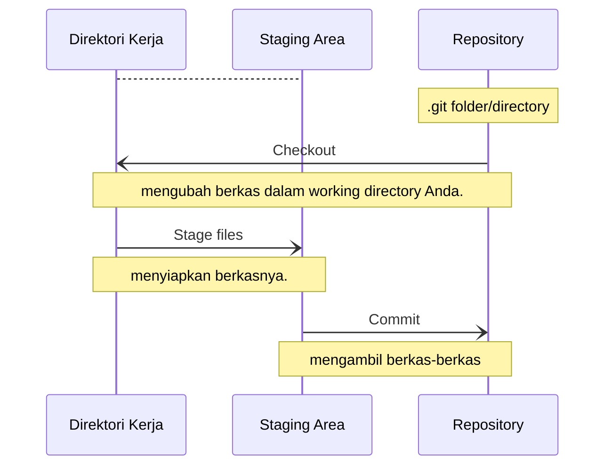

# Dasar-dasar Git


Jadi, mudahnya, apakah Git itu? Ini adalah bab yang penting untuk dipahami, karena jika Anda memahami apa itu Git dan pemahaman dasar tentang bagaimana Git bekerja, maka, menggunakan Git dengan efektif mungkin akan menjadi lebih mudah Anda lakukan. Selama Anda belajar Git, cobalah untuk menjernihkan pikiran Anda dari hal-hal yang Anda ketahui tentang VCS lainnya, seperti Subversion dan Perforce; dengan begitu, akan membantu Anda menghindari hal-hal yang membingungkan ketika menggunakan alatnya. Git menyimpan dan berpikir tentang informasi dengan sangat berbeda daripada sistem lainnya, meskipun antarmuka penggunanya cukup mirip, dan memahami perbedaan-perbedaan tersebut akan membantu mencegah Anda menjadi bingung ketika menggunakannya.

## Snapshots, Bukan Perbedaan-perbedaan

Perbedaan besar antara Git dan VCS lainnya (Subversion dan sejenisnya) adalah tentang cara Git berpikir tentang datanya. Secara konsep, kebanyakan sistem lain menyimpan informasi sebagai sebuah daftar dari perubahan-perubahan berbasis berkas. Sistem-sistem tersebut (CVS, Subversion, Perforce, Bazaar, dan seterusnya) berpikir tentang informasi yang mereka simpan sebagai sekumpulan berkas dan perubahan-perubahan yang dibuat kepada tiap berkas sepanjang waktu.




Git tidak berpikir atau menyimpan datanya dengan cara ini. Namun, Git berpikir tentang datanya lebih seperti sekumpulan `snapshot` dari sebuah `miniatur filesystem`. Setiap kali Anda melakukan `commit`, atau menyimpan keadaan dari proyek Anda di Git, pada dasarnya itu mengambil sebuah gambar tentang bagaimana tampilan semua berkas Anda pada saat itu dan menyimpan acuan kepada `snapshot` tersebut. Singkatnya, jika berkas-berkas itu tidak berubah, Git tidak menyimpan berkasnya lagi, hanya menautkan ke berkas yang sama persis sebelumnya yang telah tersimpan. Git berpikir tentang datanya lebih seperti sebuah `aliran snapshot`.



Ini adalah perbedaan penting antara Git dan hampir semua VCS lainnya. Hal itu membuat Git mempertimbangkan ulang hampir semua aspek dari `version control` yang kebanyakan sistem lainnya tiru dari generasi sebelumnya. Ini membuat Git lebih seperti sebuah `filesystem` kecil dengan beberapa alat yang sangat hebat terpasang padanya, daripada hanya sebuah VCS sederhana. Kita akan menjelajahi beberapa keuntungan yang Anda dapatkan dengan berpikir tentang data Anda seperti ini ketika kami membahas percabangan Git pada Git Branching

## Hampir Setiap Pekerjaan Adalah Lokal

Kebanyakan pekerjaan pada Git hanya membutuhkan berkas-berkas dan sumber daya lokal untuk bekerja – secara umum, tidak ada informasi yang dibutuhkan dari komputer lain dalam jaringan Anda. Jika Anda terbiasa dengan CVCS di mana kebanyakan pekerjaan memiliki kelebihan `network latency`, aspek ini dalam Git akan membuat Anda berpikir bahwa Tuhan telah memberkati Git dengan kekuatan yang tak dapat diungkapkan dengan kata-kata. Karena, jika Anda memiliki seluruh riwayat proyek tepat berada di dalam `local disk` Anda, kebanyakan pekerjaan terlihat hampir dalam sekejap.

Sebagai contoh, untuk meramban riwayat dari proyek, Git tidak perlu pergi ke `server` untuk mendapatkan riwayat dan menampilkannya kepada Anda – dia hanya membacanya langsung dari basis data lokal Anda. Ini berarti Anda melihat riwayat proyek hampir dalam sekejap. Jika Anda ingin melihat perubahan-perubahan yang dikenalkan antara versi sekarang dari sebuah berkas dan berkasnya pada saat sebulan yang lalu, Git dapat mencari berkasnya sebulan yang lalu dan melakukan perhitungan perbedaan secara lokal, bukannya meminta kepada `remote server` untuk melakukannya atau menarik versi lama dari berkas dari `remote server` untuk melakukannya secara lokal.

Ini juga berarti bahwa hanya ada sedikit hal yang tidak dapat Anda lakukan ketika Anda berada di luar jaringan atau di luar VPN. Jika Anda sedang mengendarai pesawat terbang atau kereta dan ingin sedikit bekerja, Anda dapat melakukan `commit` dengan bahagia hingga Anda mendapat sambungan jaringan untuk mengunggah. Jika Anda pulang dan tidak dapat menggunakan klien VPN dengan wajar, Anda masih dapat bekerja. Pada banyak sistem lain, melakukan hal tersebut adalah tidak mungkin atau sangat susah. Pada Perforce, misalnya, Anda tidak dapat melakukan banyak hal ketika Anda tidak tersambung ke `server`; dan pada Subversion dan CVS, Anda dapat menyunting berkas, namun Anda tidak dapat melakukan `commit` tentang perubahan-perubahan ke basis data Anda (karena basis data Anda sedang luring). Ini mungkin tidak terlihat seperti sebuah masalah, namun, Anda mungkin akan terkejut betapa besar perbedaan yang dapat dibuatnya.

## Git Memiliki Integritas

Semuanya dalam Git telah dilakukan `checksum` sebelum itu disimpan dan kemudian mengacu pada `checksum` tersebut. Ini berarti bahwa tidak mungkin untuk mengubah isi dari sebarang berkas atau direktori tanpa diketahui oleh Git. Kemampuan ini terpasang pada Git pada tingkat paling bawah dan terpadu pada filosofinya. Anda tidak dapat kehilangan informasi dalam singgahan atau mendapat berkas yang `corrupt` yang tidak terlacak oleh Git.

Cara kerja yang digunakan oleh Git untuk melakukan `checksum` disebut dengan SHA-1 `hash`. Ini adalah kumpulan kata sepanjang 40 karakter dari karakter heksadesimal (0-9 dan a-f) dan dihitung berdasarkan isi dari sebuah berkas atau struktur direktori dalam Git. Sebuah SHA-1 `hash` nampak seperti berikut:

```title="Contoh hash"
24b9da6552252987aa493b52f8696cd6d3b00373
```

Anda akan melihat nilai `hash` tersebut di semua tempat pada Git karena dia sering menggunakannya. Nyatanya, Git menyimpan semuanya dalam basis datanya bukan dari nama berkas, namun dari nilai `hash` isinya.

## Git Umumnya Hanya Menambah Data

Ketika Anda melakukan aksi dalam Git, hampir semuanya hanya menambahkan data ke basis data Git. Adalah sulit untuk membuat sistem melakukan apapun yang tidak dapat dikembalikan atau membuatnya menghapus data dalam berbagai cara. Seperti pada VCS lain, Anda dapat kehilangan atau mengacak-acak perubahan yang belum Anda `commit`; namun, setelah Anda melakukan `commit snapshot` ke Git, akan sangat sulit untuk kehilangan, terutama jika Anda menyimpan ke basis data Anda ke `repository` lain secara rutin.

Ini membuat menggunakan Git adalah sebuah kebahagiaan, karena kita tahu kita dapat melakukan uji coba tanpa bahaya dari mengacak-acak hal-hal. Untuk melihat lebih dalam tentang bagaimana Git menyimpan datanya dan bagaimana Anda dapat memulihkan data yang kelihatannya hilang, lihat 

## Tiga Keadaan

Sekarang, perhatikan. Ini adalah hal utama untuk diingat tentang Git jika Anda ingin sisa perjalanan belajar Anda berjalan dengan lancar. Git memiliki tiga keadaan utama yang berkas-berkas Anda dapat masuk ke dalamnya: `committed`, `modified`, dan `staged`. Committed berarti datanya telah tersimpan dengan aman pada basis data lokal Anda. `Modified` berarti Anda telah mengubah berkas, namun belum di-`commit` ke basis data Anda. `Staged` berarti Anda telah menandai berkas yang telah diubah ke dalam versi sekarang untuk `snapshot commit` Anda selanjutnya.

Ini memimpin kita kepada tiga bab utama dalam proyek Git: direktori Git, `working directory`, dan `staging area`.




Directory Git adalah di mana Git menyimpan `metadata` dan `basis data` obyek untuk proyek Anda. Ini adalah bagian paling penting tentang Git, dan ini adalah apa yang disalin ketika Anda menggandakan sebuah `repository` dari komputer lain.

`Working directory` adalah sebuah `checkout` tunggal dari satu versi milik proyek. Berkas-berkas ini ditarik dari basis data yang telah dimampatkan dalam direktori Git dan ditempatkan pada diska untuk Anda gunakan atau sunting.

`Staging area` adalah sebuah berkas, umumnya berada pada direktori Git Anda, yang menyimpan informasi tentang apa yang akan menjadi `commit` Anda selanjutnya. Terkadang disebut juga sebagai index, namun juga sering disebut sebagai `staging area`

Alur kerja dasar Git adalah seperti berikut:

1. Anda mengubah berkas dalam `working directory` Anda.
2. Anda menyiapkan berkasnya, menambah `snapshot` darinya ke `staging area` Anda.
3. Anda melakukan `commit`, yang mengambil berkas-berkas yang ada pada `staging area` dan menyimpan `snapshot` tersebut secara tetap ke dalam direktori Git Anda.

Jika sebuah versi tertentu dari sebuah berkas ada pada direktori Git, itu dianggap telah `committed`. Jika itu diubah, namun telah ditambahkan ke `staging area`, maka itu `staged`. Dan jika itu telah diubah sejak setelah di-`check out`, namun `belum staged`, maka itu adalah `modified`. Dalam [bab_dasar-dasar_git], Anda akan belajar lebih banyak tentang keadaan tersebut dan bagaimana Anda dapat memanfaatkannya atau melewati semua ke bagian `staged`.

